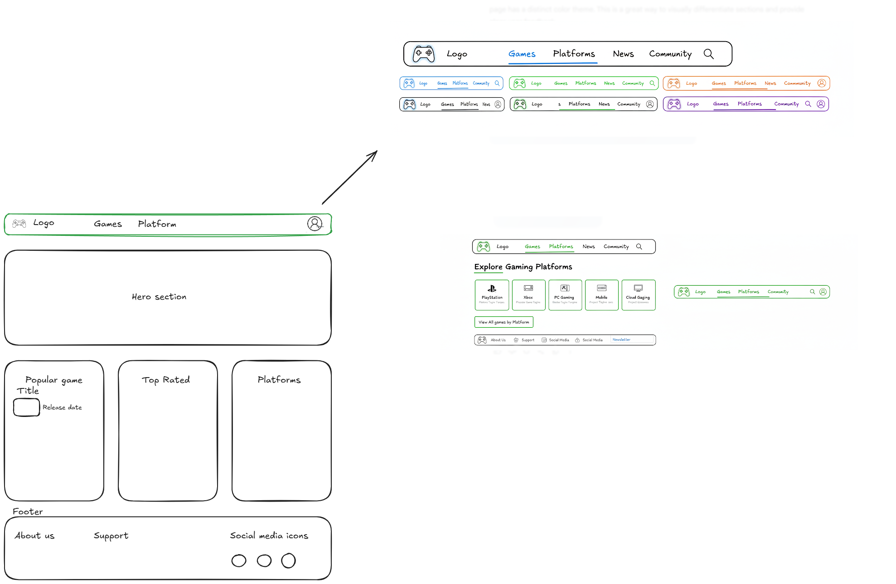

# Next Level

As of week 2 project I have used the knowledge of week 1 + 2 e.g. html and css to create a multipage website with the use of flex, grid and css varibles. Also I have used media query to make my website response on smaller screens. The the webpage is created using the wireframe from week 2 task.
The website is a gaming platform that show top games and supported platforms like.

## Deployment

The project is deployed with GitHub Pages.  
Project Preview: [Next Level](https://alexraju01.github.io/multi-page-responsive-website/)
Wireframe Preview: 
